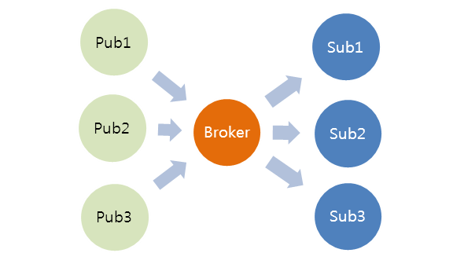

###### CENTRO FEDERAL DE EDUCAÇÃO TECNOLÓGICA DE MINAS GERAIS   ENGENHARIA DE COMPUTAÇÃO   Sistemas Distribuídos   Prof. Anolan Barrientos   2017-1

# Trabalho Prático 1: Comunicação

#### Pedro Felipe Froes   Saulo Antunes

Trabalho prático realizado para a disciplina de Sistemas Distribuídos do curso de Engenharia de Computação do CEFET-MG, lecionada pela Prof. Anolan Barrientos.

## 1 Introdução

Um sistema distribuído será construído através de um jogo no sistema operacional Android, utilizando a IDE Android Studio para o desenvolvimento da aplicação.

Através de uma integração entre os dispositivos (_machine to machine_, M2M), variáveis como localização e temperatura podem ser compartilhadas. O protocolo _Message Queuing Telemetry Transport_ (MQTT) pode ser utilizado para implementar um sistema de _publishers_ e _subscribers_, com os dispositivos móveis Android publicando essas variáveis, que podem ser acessadas por usuários através de um cliente conectado a um servidor HTTP.

Para a obtenção das variáveis atreladas a cada dispositivo, pode-se utilizar a API do Google Play atrelada à localização e à temperatura, por exemplo. Essa API é responsável por gerenciar os serviços relacionados à variável de localização, disponibilizando métodos para o programador escolher quais mais se adequam à sua aplicação.

## 2 Desenvolvimento da aplicação

### 2.1 _Setup_ inicial do projeto

Um novo projeto pode ser criado no Android Studio selecionando a opção _Empty project_ ao iniciá-lo. O projeto criado possui as pastas `manifest` e `java`, que contem arquivos de metadados e de código do projeto, respectivamente, e uma seção de _scripts_ do Gradle que auxiliam na compilação e criação do projeto.

Para acessar variáveis do dispositivo como localização e temperatura, é necessário importar a API do Google Play para o projeto, o que pode ser feito através do Android Studio na seção de `Tools/Android/SDK Manager`, incluindo a API no Gradle posteriormente. Foram importadas especificamente a API relacionada à localização e temperatura. Posteriormente, é necessário atualizar as permissões da aplicação para acessar a localização do dispositivo.

### 2.2 Coleta de variáveis do dispositivo

A localização do dispositivo pode ser obtida implementando os métodos da interface `LocationListener` na classe principal. É necessário inicializar um objeto do tipo `LocationManager`, que será responsável por chamar os métodos `getSystemService` e `requestLocationUpdates`. Esse último método possui quatro parâmetros principais:

* `provider`, que recebe o provedor da localização do dispositivo – nesse caso, o GPS do mesmo;
* `minTime`, o intervalo mínimo entre a atualização da localização;
* `minDistance`, a distância mínima entre a atualização da localização;
* `listener`, o método que implementa a interface `LocationListener` – nesse caso, a classe `MainActivity`da aplicação.

Já a temperatura pode ser obtida por meio dos objetos `Sensor` e `SensorManager`, sendo especificada no método `getDefaultSensor` com o parâmetro `TYPE_TEMPERATURE` sendo passado. Finalmente, tanto a localização e quanto a temperatura são atualizadas em tempo real por meio do métodos `onLocationChanged` e `onSensorChanged`.

### 2.3 Sistema _publish-subscribe_

Um sistema _publish-subscribe_ é um padrão de troca de mensagens onde componentes enviam mensagens (os _publishers_) de uma determinada categoria, enquanto outros componentes (os _subscribers_) recebem mensagens de uma ou mais categorias. Os _publishers_ não precisam necessiariamente saber quais _subscribers_ assinam suas mensagens; analogamente, os _subscribers_ não precisam saber quais _publishers_ publicam em determinada categoria.

###### Figura 1 – Esquema de funcionamento de um sistema _publish-subscribe_.

Nesse trabalho, os _publishers_ correspondem aos dispositivos móveis, que atualizam um cliente HTML com variáveis como localização e temperatura, por exemplo, em tempo real por meio de um Broker MQTT. O Broker é responsável por distribuir as variáveis para clientes interessados de acordo com o tópico da mensagem.

**DETALHAR**

**Colocar scripts de testes usados**

### 2.4 Cliente HTML e visualização das variáveis

**ESCREVER**

## 3 Resultados

Pode-se utilizar a aplicação através de um emulador de Android ou no próprio dispositivo. Utilizando em um emulador, deve-se atentar às permissões de acesso à localização e temperatura da máquina do usuário. Para utilizar em um dispositivo, basta abrir a aplicação que tanto a localização quanto a temperatura serão atualizadas em tempo real, enviando seus valores para o cliente HTML.

No cliente HTML, a variável de cada

**ESCREVER**

**Falta: print da tela do navegador mostrando o valor medido pelas variáveis**

**Falta: dificuldades encontradas e como foram resolvidas**

###### Figura 1 – _Screenshot_ da localização do disposito obtida através do GPS.

## Referências

_**Android Developers**: Getting the Last Known Location_. Disponível em: <https://developer.android.com/training/location/retrieve-current.html>. Acesso em: 20, Mar, 2017.

_**Google API for Android**: Sensors Overview_. Disponível em: <https://developer.android.com/guide/topics/sensors/sensors_overview.html>. Acesso em: 15, Abr, 2017.

_**Google API for Android**: Set Up Google Play Services_. Disponível em: <https://developers.google.com/android/guides/setup>. Acesso em: 20, Mar, 2017.

_**TechLoveJump**: Android Tutorials. Android GPS – Location Manager Tutorial_. Disponível em: <http://techlovejump.com/android-gps-location-manager-tutorial/>. Acesso em: 20, Mar, 2017.